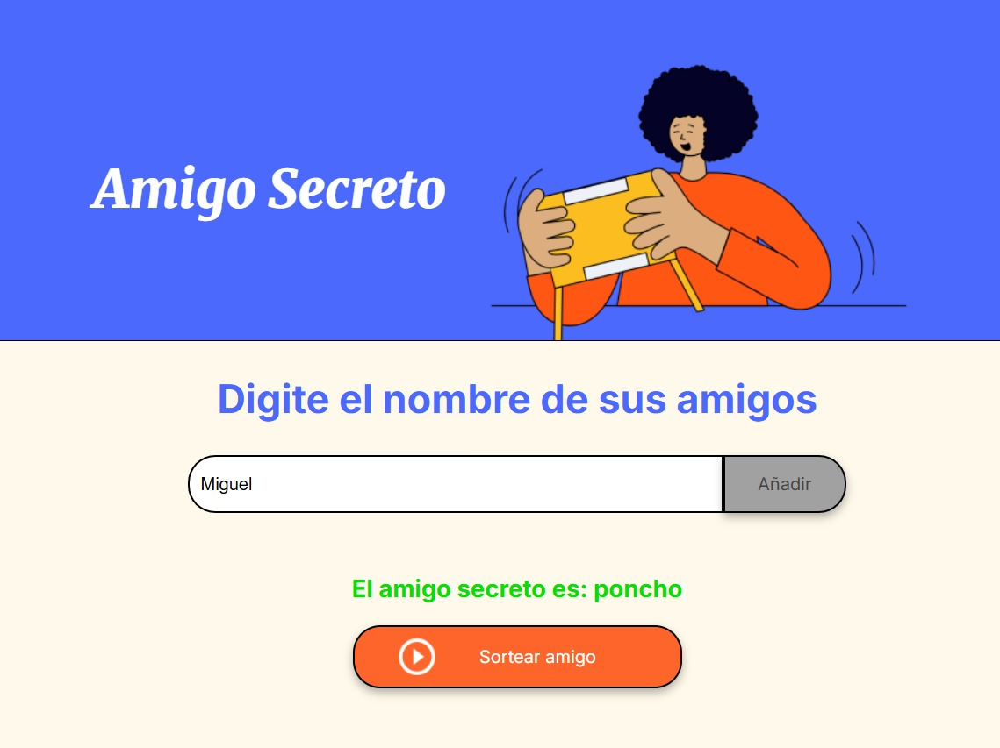
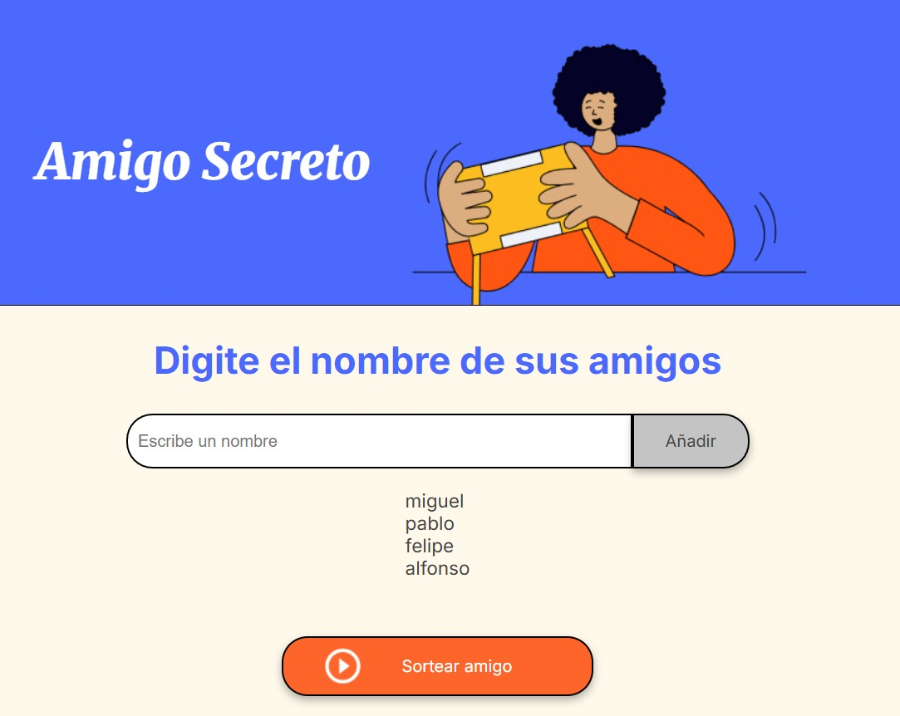
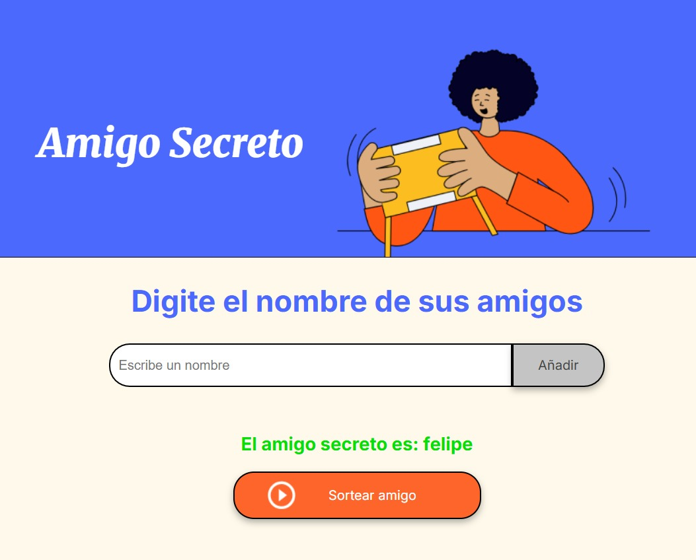

-Se iniciará el challenge amigo secreto de allura, el objetivo es crear una aplicacion que permita al usuario 
ingresar nombres de sus amigos y luego realizar un sorteo aleatorio para determinar quien es el amigo secreto.

Funcionalidades\
-Agregar nombres a una lista.\
-Mostrar la lista actualizada en pantalla.\
-Seleccionar aleatoriamente un nombre de la lista como amigo secreto.\
-Validar que no se pueda agregar nombres vacíos ni sortear sin nombres.\

Cómo usar\
-Clona o descarga este repositorio./
-Abre el archivo index.html en tu navegador ó ingresa a [text](https://miguel52870.github.io/Challenge-Amigo-Secreto/)./
-Escribe un nombre en el campo de texto.\
\
-Presiona el botón para agregar el nombre a la lista.\
\
-Cuando quieras sortear, presiona el botón para seleccionar un amigo secreto de forma aleatoria.\
-El resultado se mostrará en la pantalla.\
\

